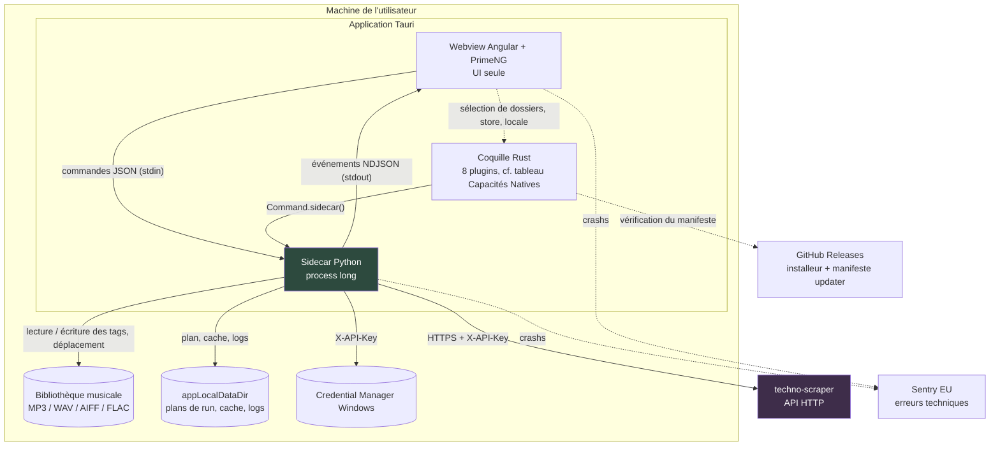
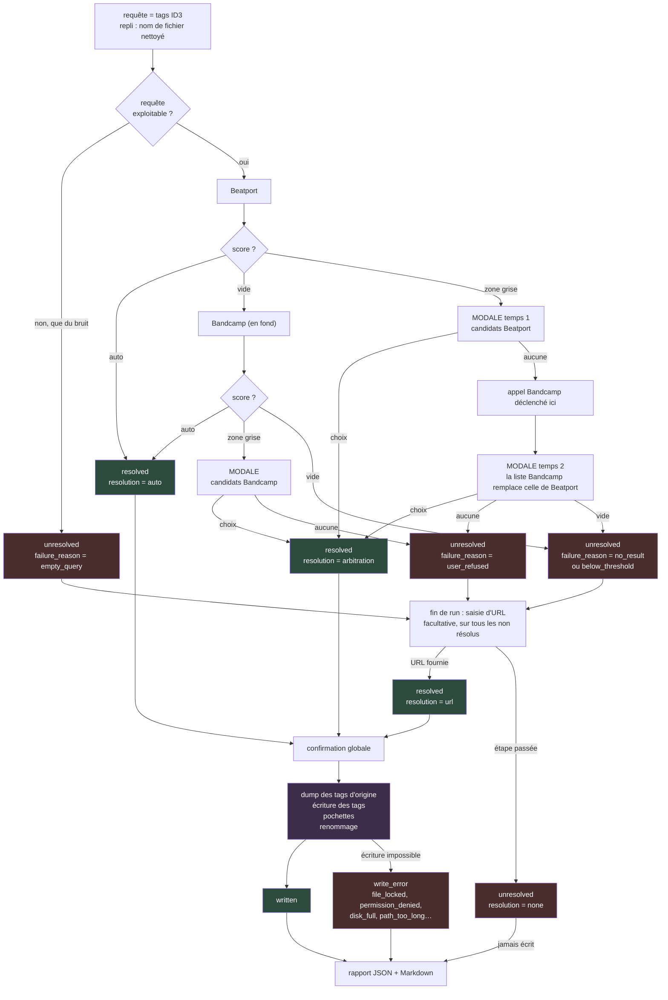
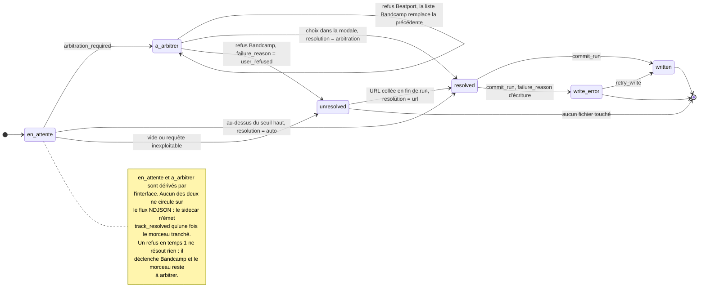
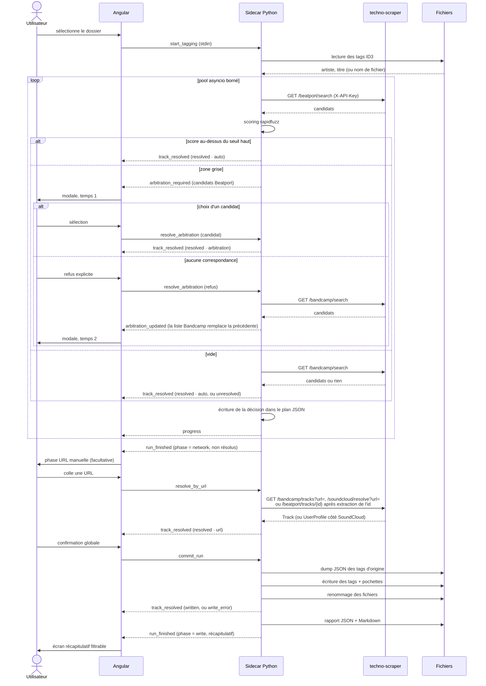

# 🧭 Contexte Projet

## Objectif

Automatiser deux corvées de la préparation d'un set DJ : extraire d'une grosse bibliothèque les morceaux d'une playlist pour les isoler dans un dossier de travail, et remplacer les métadonnées de ces fichiers par des données propres issues de Beatport et Bandcamp.

L'outil existe en CLI Python mono-utilisateur ([`BeatportScrapper-TrackTagger`](https://github.com/thibaud57/BeatportScrapper-TrackTagger)). Le projet le **modernise, l'optimise et le rend distribuable**, ces trois axes étant indissociables.

**Moderniser** : sortir des dépendances datées ou sous licence contraignante, remplacer le scraping direct qui casse à chaque changement de site par une API dédiée, et couvrir quatre formats de fichiers au lieu du seul MP3 en écrivant tout ce que la source expose plutôt qu'une dizaine de champs.

**Optimiser** : passer d'un traitement séquentiel sans cache à un pipeline concurrent qui ne repaie pas un re-run, et enchaîner deux sources au lieu d'abandonner dès que la première ne connaît pas le titre.

**Rendre distribuable** : supprimer l'édition d'un fichier de constantes Python avant chaque usage, la remplacer par une interface graphique et des réglages persistés, et livrer un installeur qui se met à jour tout seul. S'y ajoute ce que la CLI ne pouvait pas offrir : un arbitrage à l'écran quand le score est ambigu, un rattrapage manuel par URL, et une trace complète de chaque run avec possibilité de revenir en arrière.

## Type de Projet

Application desktop mono-utilisateur, sans serveur ni port ouvert. Trois couches sur la machine de l'utilisateur : webview Angular, coquille Tauri, sidecar Python. Consommatrice de l'API [techno-scraper](https://techno-scraper.empiricmind.fr) déployée en prod.

## Enjeux & Contraintes

- **Charge** : un run type traite 100 morceaux. Le débit est tenu par techno-scraper, pas par l'application ; le pool de concurrence doit rester borné pour ne pas la saturer.
- **Intégrité des fichiers** : aucun fichier n'est modifié avant confirmation globale, les tags d'origine sont sauvegardés avant réécriture, et la phase d'écriture est testable sans réseau ni interface.
- **Sécurité** : la clé `X-API-Key` ne transite jamais par la webview, elle vit dans le sidecar et est stockée dans le trousseau de l'OS.
- **Vie privée** : la remontée d'erreurs est active d'office, mais le SDK est durci pour que rien de personnel n'y transite, et aucun titre de morceau ne part sans un geste manuel. Choix produit, pas contrainte réglementaire : l'outil est personnel et non commercialisé.
- **Budget** : nul. Plan gratuit Sentry, GitHub Releases, VPS déjà payé pour l'API.
- **Équipe** : 1 personne, aucune deadline.
- **Packaging** : PyInstaller ne cross-compile pas, chaque plateforme impose son runner CI. Windows seul au MVP.
- **Scalabilité** : sans objet, application locale mono-utilisateur, aucun multi-tenant.

## Public Cible

L'auteur et quelques amis DJ. Aucune ambition commerciale, aucun compte, aucune facturation.

---

# 🏗️ Architecture Globale

## Architecture — Approche Générale

Application desktop à trois couches, avec séparation stricte des responsabilités et une frontière explicite entre l'interface et le métier.

| Couche | Rôle |
|---|---|
| Angular + PrimeNG | Interface seule : sélection de dossiers, listes, modales d'arbitrage, progression, récapitulatif |
| Sidecar Python | Tout le métier : lecture/écriture des tags, appels à techno-scraper, scoring, déplacement de fichiers, plan de run |
| Tauri / Rust | Colle uniquement : `Command.sidecar()`, permissions, packaging, updater |

La frontière UI ↔ métier est un protocole NDJSON sur les flux standard, traité comme une petite API testable en ligne de commande sans interface (cf. [ADR-005](adrs/005-sidecar-python-protocole-ndjson.md)).

## Organisation du Code

### Type de Repo

Monolithe. Dépôt unique `techno-tagger`, trois zones : `src/` (Angular), `sidecar/` (Python), `src-tauri/` (Rust). Pas de workspace, pas de packages partagés : les types TypeScript du contrat NDJSON sont maintenus à la main en miroir des modèles Python.

### Package Manager

Un par zone, aucun outil de workspace transverse. **pnpm** côté Angular, supporté nativement par Angular CLI (`ng new --package-manager pnpm`, champ `packageManager` d'`angular.json`) : store global partagé, installation plus rapide et résolution stricte, dans le même esprit qu'uv côté Python. Aucun réglage particulier n'est nécessaire, en particulier pas de `node-linker=hoisted`.

### Apps & Packages

| Nom | Chemin | Rôle | Package Manager |
|-----|--------|------|------------------|
| `techno-tagger-ui` | `src/` | Interface Angular, aucune logique métier | pnpm |
| `tagger` | `sidecar/` | Métier complet, binaire PyInstaller | uv |
| `techno-tagger` | `src-tauri/` | Coquille Tauri, initialisation des plugins | cargo |

### Arborescence

```
techno-tagger/
├── src/                                  # Angular : UI uniquement
│   ├── app/
│   │   ├── core/
│   │   │   ├── sidecar.service.ts        #   flux NDJSON <-> sidecar
│   │   │   ├── scrub.ts                  #   masquage PII avant envoi Sentry
│   │   │   └── models/                   #   types miroir du contrat JSON
│   │   ├── features/
│   │   │   ├── playlist/                 #   onglet 1 : dossiers, playlist, déplacement
│   │   │   ├── tagging/                  #   onglet 2 : liste, arbitrage, récapitulatif
│   │   │   └── settings/                 #   clé API, URL, langue, seuils, copie/déplacement,
│   │   │                                 #   signal sonore, cache, logs
│   │   ├── app.component.ts
│   │   ├── app.routes.ts
│   │   └── app.config.ts
│   ├── assets/icons/                     #   4 SVG Simple Icons : beatport, bandcamp, soundcloud, vlc
│   ├── index.html
│   ├── main.ts                           #   bootstrapApplication, init Sentry
│   ├── build-constants.d.ts              #   constantes substituées par --define
│   └── styles.css                        #   CSS pur, jamais SCSS
├── public/i18n/                          #   JSON ngx-translate : Angular sert public/ à la racine
├── angular.json
├── .postcssrc.json                       # @tailwindcss/postcss
├── package.json                          #   dépendances front, versions dans VERSIONS.md
│
├── sidecar/                              # le métier Python
│   ├── pyproject.toml                    #   pydantic, mutagen, rapidfuzz, httpx2, keyring, sentry-sdk
│   ├── uv.lock
│   ├── src/tagger/
│   │   ├── __main__.py                   #   boucle de commandes, émission d'événements
│   │   ├── build_info.py                 #   façade des constantes gravées au packaging
│   │   ├── logger.py                     #   fichier tournant + stderr, jamais stdout
│   │   ├── observability.py              #   init Sentry durci, scrubbing PII
│   │   ├── protocol.py                   #   modèles des commandes et des événements
│   │   ├── playlists/                    #   parsing VLC SQLite et M3U8
│   │   ├── files.py                      #   mutagen : lecture/écriture des tags
│   │   ├── matching.py                   #   scoring rapidfuzz
│   │   ├── scraper_client.py             #   appels techno-scraper + X-API-Key
│   │   ├── cache.py                      #   réponses API et artworks
│   │   └── plan.py                       #   plan de run, reprise, rapport
│   ├── tests/                            #   pytest, seuil de couverture bloquant en CI
│   │   ├── unit/                         #     un module isole, miroir de src/tagger/
│   │   ├── integration/                  #     plusieurs modules, protocole NDJSON compris
│   │   ├── fixtures/                     #     donnees figees : audio, vlc_media.db, M3U8
│   │   └── helpers/                      #     constructeurs partages, importables a plat
│   ├── tagger.spec                       #   hidden imports et métadonnées collectées
│   └── build.py                          #   PyInstaller -> binaire
│
├── src-tauri/
│   ├── binaries/
│   │   ├── tagger-x86_64-pc-windows-msvc.exe   # suffixe target-triple OBLIGATOIRE
│   │   └── _internal/                          # deps PyInstaller --onedir -> bundle.resources
│   ├── capabilities/default.json         #   permissions : shell(sidecar), dialog, fs, store, os, opener, updater
│   ├── icons/
│   ├── src/
│   │   ├── main.rs                       #   entrée desktop, généré, jamais modifié
│   │   └── lib.rs                        #   ~5 lignes : init des plugins
│   ├── tauri.conf.json                   #   bundle.externalBin, frontendDist, assetProtocol
│   └── Cargo.toml
│
├── Justfile                               # recettes dev, qualité, build, setup
└── README.md
```

> **Le code Rust est une zone morte, la configuration Tauri non.** Seul `src-tauri/src/` (soit `main.rs` et `lib.rs`) est figé : on y colle l'initialisation des plugins et on n'y retourne jamais. Toute logique qui s'y installerait serait à réécrire au premier changement de coquille, et échapperait aux tests Python comme aux tests Angular. Le reste de `src-tauri/` se modifie régulièrement, `tauri.conf.json` pour `externalBin` et l'updater, `capabilities/default.json` pour les permissions, `binaries/` qui reçoit le sidecar à chaque build. Tout le code applicatif, lui, vit dans `src/` et `sidecar/`.

## Composants Principaux (Haut Niveau)

- **Frontend** : desktop, webview système pilotée par Tauri v2, Angular + PrimeNG
- **Backend** : sidecar Python, process long local, protocole NDJSON sur stdin/stdout, aucun port réseau
- **Données** : aucune base. Plan de run JSON, cache disque, rapports JSON + Markdown
- **Processing** : pool asyncio borné dans le sidecar, plusieurs morceaux en vol simultanément
- **Sécurité** : clé `X-API-Key` dans le trousseau de l'OS via keyring, jamais exposée au JavaScript
- **Intégrations Externes** : techno-scraper (seule source de données), Sentry (erreurs techniques), GitHub Releases (distribution et updater)

## Diagrammes d'Architecture



## Flux Fonctionnels (Use-cases critiques)

### Use-case 1 : Extraction sélective par playlist

L'utilisateur choisit un dossier source (parcouru récursivement), un dossier destination et un fichier de playlist (SQLite `vlc_media.db` ou M3U8). Le dump VLC contenant toute la médiathèque, le sidecar en liste d'abord les playlists avec leur nombre de morceaux et l'utilisateur choisit dans un sélecteur ; le schéma est vérifié avant tout traitement (cf. [ADR-019](adrs/019-resilience-schema-vlc-media-db.md)).

Le sidecar résout ensuite chaque entrée **par nom de fichier, jamais par chemin** : le chemin stocké dans la playlist est ignoré, seul le nom est cherché récursivement dans le dossier source. Sans ça le cas principal ne marche pas, la base venant du téléphone Android quand les fichiers sont sur le PC. Les morceaux trouvés sont copiés (défaut) ou déplacés vers la destination, les absents sont logués et le traitement continue. Quand plusieurs fichiers portent le même nom, le plus volumineux est retenu et les candidats écartés sont consignés (cf. [ADR-020](adrs/020-doublons-noms-de-fichiers.md)). Un **rapport d'extraction** est écrit dans le dossier destination, distinct du rapport de run que produit le re-tagging.

### Use-case 2 : Pipeline de re-tagging

L'utilisateur choisit un dossier, typiquement la destination du use-case 1. Pour chaque fichier, la requête est construite depuis les tags ID3 artiste et titre, avec repli sur le nom de fichier nettoyé, ce qui couvre aussi bien les fichiers déjà à peu près taggés que les téléchargements sauvages nommés `track01.mp3`. Le sidecar interroge techno-scraper en pool asyncio borné, score les candidats avec rapidfuzz, et classe chaque morceau en **auto**, **zone grise** ou **vide**. Le pipeline ne s'arrête jamais : les morceaux ambigus s'empilent dans une file d'arbitrage traitée en parallèle du réseau.

**Seuils de départ hérités de la CLI**, qui applique déjà ce modèle à trois états : plancher de **70** sur le score artiste et sur le score titre pris séparément, sous lequel le candidat est écarté ; seuil haut de **90** sur la moyenne des deux, au-dessus duquel la validation est automatique. Entre les deux, zone grise. Réglables dans les Settings.

> **Hérités ne veut pas dire transposables.** Le passage de fuzzywuzzy à rapidfuzz est neutre, même algorithme et même échelle 0-100. Celui de la CLI à cette application ne l'est pas : le contrat de sortie de l'API a changé, les chaînes comparées ne sont plus les mêmes. 70 et 90 sont donc à recalibrer aux premiers runs réels (cf. [ADR-008](adrs/008-matching-rapidfuzz-et-agent-ia.md)).

**Règles de scoring** reprises telles quelles : `token_sort_ratio` quand l'artiste contient une virgule ou une esperluette, `ratio` sinon ; et un candidat sans mention de remix est écarté quand la requête en contient une.

**Nettoyage de la requête** avant envoi. Il s'applique à la **chaîne interrogée**, jamais aux tags du fichier : que la source soit les tags ID3 ou le nom de fichier, le bruit est le même. Le motif porte sur le **contenu, pas sur le délimiteur**, `[FREE DL]` et `(Free DL)` devant tomber ensemble. La liste des motifs (mentions de téléchargement, marqueurs d'encodage, numéros de piste, noms de labels) relève de la spec de la feature et se règlera au premier run réel.

> **Garde absolue** : un groupe n'est jamais retiré s'il contient une **mention de version** (`mix`, `remix`, `edit`, `version`, `dub`, `extended`, `radio`) ou de **collaboration** (`feat.`, `ft.`, `featuring`, `with`, `pres.`, `vs.`). `(Adam Beyer Remix)` et `feat. Roisin Murphy` **identifient le morceau** : Beatport traite le featuring comme un artiste à part entière, et supprimer une mention de version casserait la règle de scoring ci-dessus, qui écarte un candidat sans remix quand la requête en contient un. Cette garde contraint donc deux modules, pas seulement le nettoyage.

### Use-case 3 : Arbitrage utilisateur

Dès qu'un morceau entre en zone grise et qu'aucune modale n'est ouverte, la modale s'affiche avec les seuls candidats en zone grise et leur score. Un refus explicite déclenche l'appel Bandcamp, dont la liste **remplace celle de Beatport dans la même fenêtre**. Bandcamp n'est jamais appelé spéculativement (cf. [ADR-009](adrs/009-enchainement-sources-et-arbitrage.md)). Navigation entre arbitrages en attente par flèches avec compteur.

### Use-case 4 : Rattrapage par URL

Dernière phase réseau, entièrement **facultative**. Une fois le pipeline terminé, l'utilisateur peut coller une URL Beatport, Bandcamp ou SoundCloud sur chaque morceau resté non résolu, quelle qu'en soit la cause. C'est le seul point d'entrée de SoundCloud, dont les métadonnées d'upload sont trop peu fiables pour une recherche automatique.

L'URL est résolue via la route correspondante de l'API, avec sa propre barre de progression. **Les trois sources n'ont pas la même voie** : Bandcamp et SoundCloud résolvent l'URL directement, Beatport n'expose pas de résolution par URL et impose d'extraire l'identifiant du morceau de l'URL collée pour appeler la route par id. L'étape se passe intégralement.

### Use-case 5 : Écriture et renommage

**Le point de non-retour du run**, et la seule phase qui touche aux fichiers musicaux. Déclenchée par la confirmation globale, jamais avant (cf. [ADR-010](adrs/010-ecriture-batch-et-plan-de-run.md)).

Quatre opérations dans cet ordre, sur chaque morceau résolu : dump JSON des tags d'origine, écriture des tags, incorporation de la pochette, puis renommage. Le renommage vient toujours en dernier, puisqu'il relit les tags fraîchement écrits. L'ensemble dure quelques secondes, les pochettes ayant été téléchargées pendant la phase réseau.

Le motif est `{artist} - {title}.{ext}`, débarrassé des caractères interdits par le système de fichiers. Non configurable au MVP ; un motif libre à jetons reste une évolution possible.

Un fichier en échec n'interrompt jamais la phase : il est consigné et l'écriture se poursuit sur les suivants (cf. § [Robustesse](#-robustesse--modes-de-panne)). Le run se termine par l'écriture du rapport dans le dossier destination et l'affichage du récapitulatif filtrable.

### Use-case 6 : Reprise d'un run interrompu

Chaque décision est écrite au fil de l'eau dans un plan JSON dans `appLocalDataDir()`. Au lancement suivant, un run inachevé est détecté et l'application propose de reprendre ou de repartir de zéro. Aucun fichier n'a été touché entre-temps, la reprise est donc sans risque.

## Chaîne de résolution d'un morceau



Trois états après interrogation d'une source : **auto** (un candidat au-dessus du seuil haut), **zone grise** (candidats plausibles, décision humaine), **vide** (zéro résultat ou tout sous le plancher). Zéro résultat, candidats sous le plancher et refus utilisateur convergent tous vers **un seul `state`**, `unresolved`, le paquet que la phase URL rattrape. Leur `failure_reason` continue de les distinguer dans le rapport, la correction à apporter n'étant pas la même selon le motif.


## Patterns Utilisés

- **Séparation UI / métier par protocole** : la frontière n'est pas un appel de fonction mais un contrat de messages, ce qui rend le métier testable en ligne de commande et l'UI remplaçable
- **Event streaming unidirectionnel** : commandes de l'UI vers le sidecar, flux d'événements du sidecar vers l'UI, jamais de requête/réponse synchrone bloquante
- **Write-ahead planning** : les décisions sont persistées avant l'effet de bord, jamais l'inverse, ce qui rend la reprise triviale et le crash inoffensif
- **Cache jetable** : le dossier de cache peut être supprimé à tout moment sans rien casser, seulement des appels réseau à repayer
- **Anti-corruption layer** : `scraper_client.py` isole le contrat de techno-scraper du reste du métier, un changement d'API ne touche qu'un fichier

---

# 🌐 Architecture Technique

## 🎨 Frontend

### Framework

**Angular 22**, webview système pilotée par **Tauri v2**. Angular est déjà maîtrisé, et Next.js n'apporterait rien sans serveur Node (cf. [ADR-002](adrs/002-framework-ui-angular.md)).

Angular 22 fait d'**OnPush la stratégie de détection de changement par défaut** pour les composants qui n'en déclarent pas. Sans incidence ici : l'état passe par des signals, et ngx-translate documente la compatibilité OnPush de son pipe et de sa directive.

### Styling & UI

- **Bibliothèque de composants** : **PrimeNG v22**, sous Community License gratuite, valable 12 mois avec 30 jours de grâce et renouvelable sans frais. Aucune limitation fonctionnelle sur la bibliothèque centrale ; le Theme Designer n'est pas inclus, toute personnalisation passe par `definePreset()` (cf. [ADR-003](adrs/003-primeng-community-license.md))
- **Preset** : **Aura**, import `@primeuix/themes/aura` (base 16px, pas la variante `-compat`)
- **Mode sombre par défaut**, forcé via `darkModeSelector` dans `providePrimeNG()` et une classe posée sur `<html>`. Cohérent avec les outils DJ (Rekordbox, Traktor, Serato) et avec un usage nocturne. Aucun sélecteur clair/sombre à maintenir au MVP.
- **Table à scroll virtuel** PrimeNG pour les listes de 100 lignes et le tableau récapitulatif filtrable
- **Styling utilitaire** : **Tailwind CSS v4** avec le plugin officiel **`tailwindcss-primeui`**, qui expose les design tokens du preset en classes. L'alignement du variant `dark:` sur le `darkModeSelector` reste une ligne à écrire dans le CSS global. PrimeNG livre les composants, Tailwind couvre le layout et l'espacement qui restent à écrire. Contrainte à connaître : **Tailwind v4 ne compile ni SCSS ni LESS**, tout le styling du projet est donc en CSS pur
- **Typographie** : **Inter**, paquet `@fontsource-variable/inter` embarqué dans le bundle. Aucun CDN de polices, l'application devant s'afficher identiquement hors ligne. Le preset Aura ne déclare aucune `font-family`
- **Icônes** : **`@primeicons/angular`**, tiré par PrimeNG v22, qui rend des composants standalone en SVG inline et non plus une police avec des classes `pi pi-*`. S'y ajoutent quatre SVG **Simple Icons** dans `src/assets/icons/` pour les logos Beatport, Bandcamp, SoundCloud et VLC, absents du jeu

Le détail (tokens, scale typographique, mapping composant par composant, conventions de style et anti-patterns) vit dans [DESIGN.md](DESIGN.md).

### State Management

**Services injectés + signals natifs Angular**, aucune bibliothèque de store. Un service par feature expose des `signal()` writable et des `computed()`, alimentés par le flux d'événements du sidecar. `SidecarService` détient l'état du run et la file d'arbitrage, les composants ne font que lire et émettre des commandes.

Trois écrans et une file d'arbitrage ne justifient pas la cérémonie d'un NgRx. À réévaluer si le récapitulatif et le rollback multiplient les transitions d'état.

### Navigation

**Angular Router**, trois routes lazy-loaded (`/playlist`, `/tagging`, `/settings`) rendues dans un `p-tabs`. Permet le deep-link vers le récapitulatif d'un run passé et évite de charger les trois features au démarrage.

PrimeNG v22 ne fournit **aucun mode router** sur `p-tabs`, et `p-tabMenu` a été supprimé de la bibliothèque. L'onglet actif se dérive donc de l'URL et la navigation se déclenche au changement de valeur, soit une dizaine de lignes dans le shell (cf. [DESIGN.md § Mapping Composants](DESIGN.md#mapping-composants)).

### Capacités Natives

Via les plugins Tauri v2, déclarés dans `src-tauri/capabilities/default.json` :

| Plugin | Usage |
|---|---|
| `shell` | Lancement du sidecar via `Command.sidecar()`. Permission `shell:allow-spawn` et non `shell:allow-execute` : le sidecar est un process long démarré par `spawn()`, pas une exécution ponctuelle. La permission cible le chemin du sidecar avec `"sidecar": true`, aucune commande arbitraire n'est autorisée. |
| `dialog` | Sélection des dossiers source, destination et du fichier de playlist |
| `fs` | Accès aux chemins choisis par l'utilisateur, périmètre restreint |
| `store` | Préférences : langue, seuils, mode copie / déplacement, signal sonore. **L'URL de l'API y est persistée mais transmise au sidecar par `set_api_url`**, seul à appeler techno-scraper |
| `os` | Lecture de la locale système au premier lancement (`locale()`, format BCP-47) |
| `opener` | Bouton « ouvrir le dossier de logs » des Settings, et lien vers la fiche source du récapitulatif. En Tauri v2, l'ouverture d'un chemin ou d'une URL a quitté `shell` pour ce plugin dédié ; la permission `shell` retenue ici étant `shell:allow-spawn` restreinte au sidecar, elle ne couvre ni l'un ni l'autre |
| `single-instance` | Un second lancement donne le focus à la fenêtre existante. Deux fenêtres signifieraient deux sidecars écrivant le même plan de run (cf. § [Robustesse](#-robustesse--modes-de-panne)) |
| `updater` | Vérification du manifeste au démarrage, téléchargement et installation signés |

Le **signal sonore ne se déclenche qu'à la fin de la phase réseau**, quand l'écran d'arbitrage prend la main. Un son par arbitrage serait une vingtaine de bips sur un run de 100 morceaux, et la préférence serait coupée dès le premier usage. Le pipeline continuant de tourner pendant qu'une modale attend, rien n'oblige à arbitrer au fil de l'eau : tout se traite à la fin, et c'est ce moment-là qu'il faut signaler.

Le **motif de renommage n'est pas une préférence** : il est fixé à `{artist} - {title}.{ext}` au MVP (cf. use-case 5), et n'a donc rien à persister dans le `store`.

Deux réglages ne passent pas par un plugin :

- **`app.security.assetProtocol`** dans `tauri.conf.json`, `enable: true` plus un `scope` restreint au dossier de cache. Sans lui, la webview ne peut pas afficher les pochettes lues sur le disque, que le sidecar ne transporte jamais en base64 dans le flux NDJSON (cf. [DESIGN.md § Mapping Composants](DESIGN.md#mapping-composants)).
- **Le dimensionnement de la fenêtre**, dans `tauri.conf.json` : `width` / `height` à 1280 × 800, `minWidth` / `minHeight` à 1024 × 700, `resizable` laissé à `true`, donc agrandissement libre sans plafond. Le plancher vient du jeu de colonnes de la liste d'un run (cf. [DESIGN.md § Layout](DESIGN.md#-layout--espacement)). La taille **n'est pas mémorisée** entre deux lancements : `width` et `height` s'appliquent à chaque démarrage et un agrandissement est perdu à la fermeture. Le plugin `window-state` corrigerait ça, il n'est pas retenu au MVP.

### Structure du Code

`core/` pour le service sidecar et les modèles miroir du contrat, `features/` pour les trois écrans autonomes. Aucune logique métier côté Angular : le calcul des scores, la construction des requêtes et les règles d'écriture vivent dans le sidecar.

### i18n

**ngx-translate**, français et anglais, bascule à l'exécution sans rebuild (cf. [ADR-004](adrs/004-i18n-ngx-translate.md)). Au premier lancement, la locale système décide : commence par `fr` donne du français, tout le reste donne de l'anglais. Le sélecteur des Settings force ensuite l'une ou l'autre.

### Services Externes

**@sentry/angular**, erreurs de la webview uniquement, SDK durci (cf. § Observabilité).

## 💻 Backend

### Runtime & Langage

**Python**, empaqueté en binaire autonome par **PyInstaller**. L'interpréteur et toutes les dépendances sont embarqués : aucune installation de Python n'est requise chez l'utilisateur.

### Framework

**Aucun**. Le sidecar n'est pas un serveur : `__main__.py` lit des commandes JSON ligne par ligne sur `stdin` et émet des événements NDJSON sur `stdout`. Pas de FastAPI, pas de port ouvert, pas de surface réseau entrante. **Pydantic ne fait pas exception à cette règle** : il ne sert pas de framework, seulement de brique de validation des modèles décrits ci-dessous.

### Structure du Code

Modules à responsabilité unique sous `src/tagger/`, sans framework ni couche d'injection. `protocol.py` définit les modèles **Pydantic** (cf. [ADR-022](adrs/022-modeles-pydantic-du-protocole.md)) de commandes et d'événements et constitue la seule interface publique du sidecar ; tout le reste est appelé depuis la boucle de `__main__.py`.

### API

**Protocole NDJSON bidirectionnel** sur les flux standard. Le sidecar est un process long lancé au démarrage de l'application, pas une invocation par action.

Imposé par deux besoins du MVP : la barre de progression, et le pipeline qui continue de tourner pendant qu'une modale attend une décision.

**Commandes (UI → sidecar, une par ligne sur stdin)**

| Commande | Charge utile |
|---|---|
| `get_version` | aucune. Émise au démarrage, avant toute autre commande |
| `list_playlists` | chemin du dump VLC. Sans objet pour un M3U8, qui ne contient qu'une playlist |
| `extract_playlist` | dossier source, dossier destination, chemin de la playlist, **identifiant de la playlist choisie** pour un dump VLC, mode copie ou déplacement |
| `start_tagging` | dossier cible, seuils de matching |
| `resolve_arbitration` | identifiant du morceau, candidat choisi ou refus explicite |
| `switch_arbitration_source` | identifiant du morceau, source demandée. Sert le lien de retour vers la liste Beatport après une bascule sur Bandcamp (cf. [ADR-009](adrs/009-enchainement-sources-et-arbitrage.md)), et produit un `arbitration_updated` |
| `resolve_by_url` | identifiant du morceau, URL Beatport / Bandcamp / SoundCloud |
| `commit_run` | identifiant du run, confirmation globale de l'écriture |
| `retry_write` | identifiant du run. Rejoue l'écriture sur les seuls morceaux en `write_error`, sans refaire ni la phase réseau ni les arbitrages |
| `resume_run` / `discard_run` | identifiant du plan détecté au lancement |
| `rollback` | identifiant du run, ou identifiant du morceau |
| `list_runs` | aucune. Rend les runs passés relisibles depuis leurs rapports JSON, ce qui alimente l'état vide « aucun run passé » |
| `load_run` | identifiant du run. Relit son rapport JSON et rend le récapitulatif, sans rejouer quoi que ce soit. C'est le point d'entrée que la politique de migration de l'[ADR-018](adrs/018-versionnement-plan-de-run.md) sert |
| `set_api_key` / `set_api_url` / `clear_cache` | administration depuis les Settings. **L'URL de l'API est transmise au sidecar**, seul à appeler techno-scraper : la persister dans le `store` de la webview ne suffit pas |

**Événements (sidecar → UI, NDJSON sur stdout)**

| Événement | Contenu |
|---|---|
| `version` | version du sidecar, comparée à celle de l'interface avant tout run (cf. [PRODUCTION.md](PRODUCTION.md#remplacement-du-sidecar-à-la-mise-à-jour)) |
| `playlists_listed` | playlists du dump VLC : identifiant, nom, nombre de morceaux |
| `progress` | phase en cours, traités sur total. Couvre les quatre phases longues : extraction, pipeline de tagging, rattrapage par URL et écriture |
| `extraction_finished` | morceaux copiés ou déplacés, titres introuvables, doublons résolus avec leurs candidats écartés, chemin du rapport d'extraction |
| `track_resolved` | morceau, source retenue, `state` / `resolution` / `failure_reason`, champs disponibles |
| `arbitration_required` | morceau, candidats en zone grise avec leur score, source interrogée |
| `arbitration_updated` | remplacement de la liste Beatport par la liste Bandcamp dans la modale ouverte, et retour en arrière |
| `run_finished` | `phase` (`network` après la boucle de résolution, `write` après `commit_run` ou `retry_write`), récapitulatif, chemin des rapports |
| `runs_listed` | runs passés : identifiant, date, dossier, compteurs du récapitulatif |
| `run_loaded` | récapitulatif d'un run passé, relu depuis son rapport JSON |
| `error` | `code`, `params`, `message` technique, morceau concerné le cas échéant |

**`run_finished` porte une `phase`, il n'est pas émis une seule fois.** La fin de la boucle de résolution ouvre la phase de rattrapage par URL, la fin de l'écriture ouvre le récapitulatif : deux moments distincts, deux écrans différents, un seul événement. Sans ce champ, l'interface ne peut pas savoir lequel des deux elle reçoit.

**L'état d'un morceau tient en trois champs**, jamais en une liste plate de valeurs :

| Champ | Valeurs | Rôle |
|---|---|---|
| `state` | `resolved`, `unresolved`, `written`, `write_error` | Ce que le morceau est devenu |
| `resolution` | `auto`, `arbitration`, `url`, `none` | La voie empruntée, d'où sortent les filtres du récapitulatif |
| `failure_reason` | Résolution : `empty_query`, `no_result`, `below_threshold`, `user_refused`, `source_unavailable`. Écriture : `file_locked`, `permission_denied`, `disk_full`, `path_too_long`, `file_missing`, `write_failed` | Le motif, exigé par le rapport qui distingue la requête vide des autres échecs (cf. § [Robustesse](#-robustesse--modes-de-panne)) |

**Les motifs d'écriture ne se réduisent pas au fichier verrouillé**, qui n'est que le plus fréquent sur Windows. Tous produisent le même `state` et se rattrapent par `retry_write` : c'est le motif qui change, jamais l'état ni la correction.

**`source_unavailable` couvre tout ce qui empêche la source de répondre** : 504 après le budget de l'API, timeout client, coupure réseau. Le distinguer de `no_result` n'est pas cosmétique, c'est la différence entre « la source ne connaît pas ce morceau » et « la source n'a pas répondu » : le premier est définitif, le second se rejoue tel quel sur un run suivant. Un 504 n'est pas retryé dans le run, il signale une file saturée ([ADR-017](adrs/017-taille-pool-concurrence.md)), et le morceau part en erreur.

**Un incident qui concerne un morceau ne produit jamais les deux événements.** Il sort en `track_resolved`, avec son `state` et son `failure_reason` : c'est ce que consomment la liste et les filtres du récapitulatif. L'événement `error` est réservé à ce qui ne se rattache à aucun morceau, comme une clé invalide, un dump VLC illisible ou un sidecar en perdition. Son champ « morceau concerné » ne sert qu'à situer un incident technique dans les logs, jamais à porter l'état d'un morceau. Sans cette règle, un fichier verrouillé arriverait à l'interface par deux chemins et serait compté deux fois.

Trois conséquences. **Aucun état « en attente » ni « en cours » ne circule sur le flux** : le sidecar n'émet `track_resolved` qu'une fois le morceau tranché, et l'interface affiche par défaut « en attente » tout ce qu'elle n'a pas encore reçu. Un événement `track_started` doublerait le trafic pour un signal que la barre de progression donne déjà. **Après `commit_run`, `state` passe à `written` ou `write_error`**, la voie de résolution restant lisible dans `resolution`. Et **un cas d'échec nouveau s'ajoute dans `failure_reason`**, sans jamais créer une valeur d'état de plus.



**Le filtre du récapitulatif et l'origine de la décision ne sont pas au même niveau.** Le brainstorm énumère quatre origines (« validation auto, arbitrage, URL manuelle, abandon ») pour trois filtres (« validés, arbitrés, échecs ») : le filtre sépare ce que la machine a tranché de ce qu'un humain a décidé, l'origine dit par quel mécanisme.

**L'échec se lit en premier, et il se lit sur `state`.** Les deux autres filtres se lisent ensuite sur `resolution`, ce qui les rend disjoints et couvrants :

| Filtre | Vaut | Origines couvertes |
|---|---|---|
| échecs | `state ∈ {unresolved, write_error}` | Abandon, et fichiers en échec d'écriture |
| validés | `state ∉ échecs` et `resolution = auto` | Score au-dessus du seuil haut, personne n'a regardé |
| arbitrés | `state ∉ échecs` et `resolution ∈ {arbitration, url}` | Choix dans la modale, **et** URL collée en fin de run |

Trois pièges découlent de ce tableau, et chacun casse le récapitulatif au moment où il s'affiche.

- **« Arbitrés » en `resolution === 'arbitration'`** fait disparaître les morceaux rattrapés par URL, ceux que l'utilisateur veut justement relire.
- **« Validés » ou « arbitrés » câblés sur `state`** cessent de matcher après `commit_run`, `resolved` étant devenu `written`.
- **« Échecs » câblé sur `resolution`** ne peut pas fonctionner : un `write_error` garde sa voie d'origine (`auto`, `arbitration` ou `url`), il serait indiscernable d'un morceau bien écrit. C'est aussi ce qui impose la garde `state ∉ échecs` sur les deux autres lignes, sans quoi il apparaîtrait dans deux filtres à la fois.

Ce qui rend la règle sûre est que ni `unresolved` ni `write_error` ne changent **au commit**. Un `write_error` peut encore en sortir plus tard par `retry_write`, et le filtre se vide alors à l'écran : c'est voulu.

Ce découpage est ce que consomme la colonne État de l'interface, dont les couleurs sont regroupées en quatre familles (cf. [DESIGN.md § Couleurs Sémantiques](DESIGN.md#couleurs-sémantiques)).

**Le sidecar n'émet jamais de phrase destinée à l'écran.** Il émet un `code` stable (`file_locked`, `invalid_api_key`, `vlc_schema_mismatch`…) et des `params` structurés (chemin, table manquante, nom du champ). L'interface traduit, via ngx-translate comme le reste des libellés. Le champ `message` reste du texte technique, écrit dans les logs, jamais affiché.

Sans cette règle, l'i18n serait à maintenir en double, côté Python et côté Angular, ou les erreurs s'afficheraient dans une langue différente du reste de l'interface. Elle vaut aussi pour les messages du § [Robustesse](#-robustesse--modes-de-panne), qui sont tous produits par le sidecar.

> **La règle porte sur le flux NDJSON, pas sur les fichiers.** Les artefacts que le sidecar écrit lui-même sur le disque, rapports et logs, ne passent pas par l'interface et ne sont donc pas concernés : ils sont en **anglais**, quelle que soit la langue choisie dans les Settings (cf. § [Données](#-données)).

Le contrat se teste en ligne de commande en injectant des commandes sur `stdin` et en lisant `stdout`, sans lancer l'interface. Fixer ce contrat avant d'écrire du TypeScript contre lui est l'étape 3 de l'ordre de développement.

### Concurrence

Pool **asyncio** borné, client **httpx2** (cf. [ADR-007](adrs/007-client-http-httpx2.md)), dimensionné en miroir des sémaphores de sortie de techno-scraper : **3 requêtes Beatport en vol, 2 pour Bandcamp**. Au-delà, les requêtes s'empilent derrière le sémaphore de l'API sans rien gagner et consomment son budget de 90 secondes, qui se solde par un 504 (cf. [ADR-017](adrs/017-taille-pool-concurrence.md)).

Le timeout client est fixé au-dessus de ce budget, autour de 100 secondes, pour recevoir le 504 structuré de l'API plutôt qu'un timeout local aveugle. Couper plus tôt ferait passer une saturation pour une panne réseau locale.

**Le téléchargement des pochettes a son propre pool.** L'API fournit bien l'`artwork_url` dans le contrat `Track`, mais cette URL pointe vers le CDN de la source : le téléchargement de l'image ne passe donc pas par techno-scraper et ne consomme pas ses sémaphores. Le compter dans le pool de 3 briderait les images pour rien. **Sa taille est fixée à 6, et c'est un calibrage libre, pas une contrainte d'API** : contrairement aux deux autres, aucun sémaphore distant ne le dicte, seule la politesse envers le CDN. Un échec de téléchargement n'échoue jamais le morceau : les tags sont écrits sans pochette et le rapport le signale.

La file d'arbitrage est une simple structure en mémoire, exposée à l'interface par les événements NDJSON. Aucun courtier de messages, tout vit dans un seul process.

### Sécurité Backend

- **AuthN / AuthZ** : sans objet, application locale mono-utilisateur. Aucun compte, aucun rôle, aucun port en écoute.
- **Authentification sortante** : header `X-API-Key` vers techno-scraper, une clé par utilisateur, saisie dans les Settings et stockée via **keyring** dans le Credential Manager Windows (cf. [ADR-012](adrs/012-securite-cle-api-keyring.md))
- **Durcissement** : le plugin `shell` de Tauri n'autorise que le lancement du sidecar déclaré, pas de commande arbitraire. Le périmètre `fs` est restreint aux chemins sélectionnés par l'utilisateur.
- **Validation** : toute commande reçue sur `stdin` est validée contre son modèle Pydantic avant exécution, `extra="forbid"` rejetant tout champ non déclaré ; une commande malformée produit un événement `error`, jamais un effet de bord partiel.

### Services Externes

- **techno-scraper** : seule source de données, via le domaine public et le header `X-API-Key`. Aucun scraping dans l'application (cf. [ADR-006](adrs/006-scraping-delegue-techno-scraper.md)).
- **Sentry** (`sentry-sdk`, plan Developer gratuit, région EU) : erreurs techniques uniquement, SDK durci (cf. § Observabilité).

### Agents IA

**Post-MVP uniquement.** Orchestration **PydanticAI** dans le sidecar, aucune infrastructure distante (cf. [ADR-008](adrs/008-matching-rapidfuzz-et-agent-ia.md)). Mode désactivé par défaut ; sans clé API du fournisseur renseignée, l'application se comporte exactement comme au MVP.

## 🗄️ Données

**Aucune base de données.** Trois familles de fichiers, aux durées de vie et aux emplacements distincts :

| Artefact | Emplacement | Durée de vie | Rôle |
|---|---|---|---|
| Plan de run | `appLocalDataDir()` | Purgé au démarrage si terminé, 30 jours si interrompu | État de session, reprise, rollback |
| Cache API + artworks | `appLocalDataDir()` | TTL 30 jours, plafond 500 Mo en éviction LRU | Éviter de repayer un re-run |
| Rapport d'extraction, JSON + Markdown | Dossier destination | Permanente, livrable | Titres introuvables, doublons résolus et candidats écartés |
| Rapport de run, JSON + Markdown | Dossier destination | Permanente, livrable | Traçabilité, relecture par l'app, envoi de feedback |
| Dump des tags d'origine | `appLocalDataDir()` | **30 jours, y compris pour un run terminé** | Rollback par run ou par morceau |
| Logs du sidecar | `appLocalDataDir()` | Rotation à 5 Mo, 3 sauvegardes | Débogage à distance chez un utilisateur |

Le plan vit dans `appLocalDataDir()` et non dans le dossier destination : c'est un état de session, pas un livrable, et le dossier de musique peut être déplacé ou renommé sans casser la reprise (cf. [ADR-010](adrs/010-ecriture-batch-et-plan-de-run.md)).

Deux rapports distincts sont produits, l'un par l'extraction et l'autre par le re-tagging, chacun dans le dossier destination et chacun en JSON plus Markdown. **Tous deux en anglais**, indépendamment de la langue de l'interface : le JSON l'est déjà par construction, le Markdown n'en est que le rendu (cf. [ADR-014](adrs/014-observabilite-sentry-et-rgpd.md)).

## 🗃️ Cache & Fichiers

### Cache

Deux contenus, réponses de l'API et pochettes, sous la politique décrite dans le tableau ci-dessus. Ce qui compte n'est pas le réglage mais la propriété : **le dossier est jetable à tout moment**, y compris en plein run, sans rien casser d'autre que des appels réseau à repayer. Bouton « vider le cache » dans les Settings (cf. [ADR-013](adrs/013-cache-disque-jetable.md)).

### Files / Assets Storage

Système de fichiers local exclusivement. Les pochettes sont téléchargées pendant la phase réseau, mises en cache, puis écrites en `APIC` (type 3, front cover) ou `METADATA_BLOCK_PICTURE` lors de la phase d'écriture.

### File Processing

Lecture et écriture des tags par **mutagen**, pur Python et sans dépendance hors bibliothèque standard, couvrant les quatre formats retenus, WAV compris. Deux systèmes de tags, donc deux tables de correspondance, et une écriture **en ID3v2.3** obtenue par `save(v2_version=3)`, mutagen visant v2.4 par défaut (cf. [ADR-011](adrs/011-politique-ecriture-tags.md)). pytaglib écrit les mêmes formats mais impose une dépendance native à empaqueter avec PyInstaller.

---

# 🔄 Diagramme de Séquence

Run de re-tagging complet, de la sélection du dossier au rapport.



Le contraste que ce diagramme rend visible : le plan JSON est écrit à chaque décision, les fichiers musicaux uniquement après `commit_run`.

---

# 🛠️ Infrastructure, Sécurité & Observabilité

## 🚀 Infrastructure

### Hébergement

Aucun. L'application tourne intégralement sur la machine de l'utilisateur. La seule dépendance distante est techno-scraper, déjà hébergée sur un VPS existant hors du périmètre de ce projet.

### CI/CD

**GitHub Actions**, calqué sur techno-scraper.

| Déclencheur | Étapes |
|---|---|
| Push, pull request | Ruff + Mypy strict + pytest sur `sidecar/`, lint + typecheck + Vitest sur `src/`, `cargo check` + `cargo clippy` |
| Merge de la PR release-please | Tag `vX.Y.Z`, puis **dans le même workflow** : build PyInstaller Windows, copie du binaire en `src-tauri/binaries/` avec le suffixe target-triple, `tauri build`, signature de l'updater, publication de la Release |

> ⚠️ **Le build est chaîné en `needs:` au job release-please, jamais posé sur `on: push: tags`.** Un tag créé par release-please via `GITHUB_TOKEN` ne déclenche aucun workflow : un fichier séparé sur le tag ne partirait jamais, et sans erreur, laissant une Release vide qu'aucun updater ne verrait. Mécanisme et alternative : [PRODUCTION.md](PRODUCTION.md#pipelines).

**Branches** : `main`, `develop`, `feature/*` et `hotfix/*`, comme techno-scraper. **Versioning** : release-please sur commits Conventional, tags `v*`.

**Distribution** : **dépôt public** et GitHub Releases, installeur Windows + manifeste de l'updater. Les utilisateurs n'étant pas développeurs et n'ayant pas de compte GitHub, c'est le seul canal où le téléchargement et la mise à jour sont anonymes : aucun token à embarquer dans le binaire, aucune manipulation de leur côté. Le dépôt ne contient aucun secret ni aucune ligne de scraping (cf. [ADR-021](adrs/021-visibilite-du-depot.md)).

```mermaid
graph LR
    dev["Commit / PR"] --> ci["CI : lint, typecheck, tests"]
    ci --> rp["release-please<br/>PR de release"]
    rp --> tag["Tag v*"]
    tag --> pyi["PyInstaller<br/>tagger-x86_64-pc-windows-msvc.exe"]
    pyi --> tb["tauri build<br/>installeur Windows"]
    tb --> sig["Signature du bundle<br/>TAURI_SIGNING_PRIVATE_KEY"]
    sig --> rel["GitHub Release<br/>installeur + latest.json"]
    rel --> upd["Updater : vérification au démarrage"]
    upd --> user["Machine de l'utilisateur"]

    style sig fill:#4a2d2d,color:#fff
    style rel fill:#2d4a3e,color:#fff
```



### Environnements

Deux états de l'application, pas des branches.

| Environnement | Origine | Sidecar |
|---|---|---|
| Développement | `tauri dev` en local | Lancé depuis les sources Python, sans PyInstaller |
| Distribution | Tag `v*` | Empaqueté dans l'installeur signé, consommé par l'updater |

Pas de staging : sans serveur ni base, il n'y a rien à déployer entre les deux. Un canal beta (pré-release sur un manifeste updater distinct) reste possible plus tard si la distribution s'élargit.

### Sécurité Infrastructure

Secrets GitHub Actions, injectés au build, jamais commités :

| Secret | Usage | Conséquence en cas de perte |
|---|---|---|
| `TAURI_SIGNING_PRIVATE_KEY` | Signature des bundles de l'updater | **Plus aucune mise à jour possible sur les installations existantes.** À sauvegarder hors de GitHub. |
| `TAURI_SIGNING_PRIVATE_KEY_PASSWORD` | Mot de passe de la clé ci-dessus | Idem |
| `SENTRY_DSN_SIDECAR` / `SENTRY_DSN_UI` | Remontée d'erreurs, un projet Sentry par langage (cf. [PRODUCTION.md](PRODUCTION.md#stack-monitoring)) | Régénérables |
| `PRIMENG_LICENSE_KEY` | `providePrimeNG({ license })` | Renouvellement gratuit annuel, bandeau de licence chez les utilisateurs si oublié |

La clé publique de l'updater est compilée dans `tauri.conf.json`, la clé privée ne quitte jamais les secrets GitHub.

### Scalabilité & Performance

- Scalabilité horizontale et load balancing : sans objet
- Le facteur limitant est la latence de techno-scraper, pas la machine locale. Le pool de concurrence borné existe pour ne pas saturer l'API, pas pour aller plus vite.
- Le cache disque supprime le coût réseau d'un re-run sur le même dossier
- La phase d'écriture est locale et dure quelques secondes sur 100 morceaux, les pochettes étant déjà en cache

## 🔐 Sécurité Globale

### Stratégie Sécurité

Surface d'attaque volontairement minimale : aucun port en écoute, aucune donnée personnelle stockée à distance, aucun compte. Les risques réels sont l'exfiltration de la clé API et la corruption de fichiers musicaux, traités respectivement par le trousseau de l'OS et par l'écriture différée avec dump préalable.

### Authentification & Protection API

Aucune authentification côté application : ni compte, ni rôle, ni port en écoute. La seule qui existe est celle de l'application **vers** techno-scraper.

Une clé par utilisateur, saisie dans les Settings, jamais compilée dans le binaire : une clé compilée serait extractible et sa révocation obligerait à rediffuser l'application à tout le monde (cf. [ADR-012](adrs/012-securite-cle-api-keyring.md)). Côté API, la garde compare aujourd'hui contre une clé unique et passe à un jeu de clés nommées, avec repli temporaire sur `api_key` pour ne pas rompre la compatibilité d'une API en production (cf. [ADR-016](adrs/016-multi-cles-techno-scraper.md)).

### Protection Données

- **Au repos** : clé API chiffrée par le Credential Manager Windows via keyring. Les autres artefacts (plans, cache, rapports) sont en clair, ils ne contiennent que des métadonnées musicales déjà présentes dans les fichiers.
- **En transit** : HTTPS uniquement, vers trois destinations et pas une de plus : techno-scraper, Sentry, et GitHub pour le manifeste de l'updater et le téléchargement des mises à jour.
- **Rotation** : la clé API est remplaçable depuis les Settings, la clé de signature de l'updater n'est pas rotative sans casser les installations existantes.

> **Ce qui sort de la machine.** Outil personnel partagé entre amis, sans commercialisation : le cadre réglementaire ne s'applique pas ici, et les règles ci-dessous sont des choix produit, pas des obligations. Elles coûtent trois lignes de configuration, et évitent d'envoyer chez un tiers ce qui appartient à quelqu'un d'autre.

> La protection ne passe pas par une case à cocher mais par **ce que le SDK a le droit d'envoyer** : variables locales des frames désactivées, nom de machine fixé, chemins scrubbés. Et **aucun titre de morceau envoyé automatiquement**, les cas d'arbitrage et d'échec restant dans le rapport local dont l'envoi est un geste manuel explicite. Région Sentry EU. Cf. [ADR-014](adrs/014-observabilite-sentry-et-rgpd.md).

## 🛡️ Robustesse & Modes de Panne

Les modes de panne réellement attendus, et le comportement retenu pour chacun.

### Sidecar absent, en quarantaine ou mort

**Le mode de panne le plus probable de toute l'architecture.** Les exécutables PyInstaller sont massivement détectés comme faux positifs par Windows Defender, les auteurs de logiciels malveillants utilisant le même outil. Le problème est documenté et toujours d'actualité. Trois conséquences distinctes :

| Situation | Comportement retenu |
|---|---|
| Binaire absent ou mis en quarantaine au démarrage | L'application démarre mais affiche un écran bloquant nommant le fichier attendu et son emplacement, avec la marche à suivre pour l'exclure de l'antivirus. Jamais une interface vide qui ne répond à rien. |
| Sidecar qui meurt hors run | Redémarrage automatique, une seule tentative, puis message explicite. |
| Sidecar qui meurt **pendant** un run | Le plan de run étant écrit au fil de l'eau, l'état est intact sur le disque et aucun fichier musical n'a été touché. L'application propose la reprise, exactement comme après une fermeture brutale (cf. use-case 6). |

Deux mesures de packaging réduisent la détection : le choix du mode PyInstaller et la signature du binaire. La première est tranchée, **`--onedir`**, qui n'auto-extrait rien dans `%TEMP%` et démarre par ailleurs sept fois plus vite ([ADR-015](adrs/015-cibles-distribution-windows.md)) ; la seconde est écartée faute de budget.

### Fichiers verrouillés par un autre programme

Sur Windows, un fichier tenu ouvert par un autre process ne peut pas toujours être réécrit. Aucune intégration n'est en cause : l'application ne dialogue avec aucun logiciel DJ, elle écrit des fichiers sur un disque que d'autres programmes peuvent occuper au même moment. Les cas courants sont un antivirus qui scanne le fichier pendant l'écriture, un service de synchronisation posé sur le dossier de musique, ou un lecteur audio en cours de lecture sur le morceau.

Le refus d'accès est traité comme une erreur **par fichier**, jamais comme un échec de run : le morceau est marqué en erreur, consigné dans le rapport, et les autres continuent. Le récapitulatif final propose de **relancer l'écriture sur les seuls fichiers en échec** via la commande `retry_write`, ce qui rend le cas rattrapable sans refaire ni la phase réseau ni les arbitrages.

Le verrou n'est que le motif le plus fréquent. Droits insuffisants, disque plein, chemin trop long et fichier disparu produisent le même `state` et se rattrapent de la même manière, seul leur `failure_reason` diffère (cf. § [Backend > API](#api)).

C'est le mode de panne qui justifie le plus la séparation entre le plan de run et l'écriture : le travail coûteux est déjà persisté, seule l'opération disque est à rejouer.

### Requête vide après nettoyage

`01 - [FREE DL].mp3` ou `320kbps.mp3` sont intégralement composés de bruit : après nettoyage, il ne reste rien à interroger. Le danger n'est pas le plantage mais le **faux positif** : une requête vide renvoie des résultats sans rapport, sur lesquels un score peut franchir le seuil et valider un morceau au hasard. Un plantage se voit, une validation erronée non.

1. Nettoyage produisant une chaîne vide ou sans séquence alphabétique exploitable : **la version non nettoyée est reprise**, une requête bruitée valant mieux qu'une requête vide.
2. Source elle-même inexploitable, tags absents et nom de fichier réduit à du bruit : le morceau part **directement en non résolu, sans appel réseau**.
3. Le rapport distingue ce motif des autres échecs. Ce n'est pas l'API qui n'a rien trouvé, c'est qu'on n'avait rien à lui demander, et la distinction change la correction à apporter.

C'est le seul chemin par lequel un morceau atteint l'état non résolu sans qu'aucune source n'ait été interrogée. La phase de rattrapage par URL reste ouverte pour ces morceaux.

### Clé API invalide ou révoquée

Une clé fausse ou révoquée produirait 100 échecs identiques, indiscernables d'une panne réseau dans le rapport. Le sidecar **arrête le run après trois réponses 403 consécutives** et remonte une erreur nommant explicitement la clé, avec un renvoi vers les Settings. Un 403 n'est jamais retryé, contrairement à une erreur réseau.

Un run avorté **se termine proprement sur le flux** : un `error` de code `invalid_api_key`, puis un `run_finished` de phase `network` portant le récapitulatif partiel. Sans ce second événement, l'interface attendrait indéfiniment une fin qui ne vient pas. Les morceaux non traités restent en « en attente » côté écran, aucun `track_resolved` ne les ayant tranchés, et le plan reste sur le disque : une fois la clé corrigée, le run se reprend par `resume_run` au lieu de repartir de zéro.

### Instance unique

Deux fenêtres ouvertes signifieraient deux sidecars écrivant le même plan de run et se disputant les mêmes fichiers. L'application est en **instance unique** via le plugin `single-instance` : un second lancement donne le focus à la fenêtre existante.

### Chemins longs Windows

Une bibliothèque profonde plus un renommage en `{artist} - {title}` franchissent facilement la limite de 260 caractères de l'API Win32. `LongPathsEnabled` ne suffit pas, l'application devant elle-même être manifestée pour en bénéficier, ce que l'interpréteur Python n'est pas. Le sidecar **préfixe donc ses chemins Windows par `\\?\`** pour toutes les opérations de fichiers, et tronque le nom généré si le résultat dépasse malgré tout, en le signalant dans le rapport.

## 📊 Observabilité

### Logs

`logging` Python vers un **fichier unique tournant** dans `appLocalDataDir()`, à côté des plans de run. Un `RotatingFileHandler` sur `tagger.log`, rotation à 5 Mo, 3 sauvegardes conservées, soit **20 Mo au grand maximum sur le disque**, sans purge à écrire.

La rotation se déclenche sur la **taille, jamais sur le run** : à 5 Mo, `tagger.log` devient `tagger.log.1`, les précédents se décalent et le quatrième est supprimé. Un fichier ne correspond donc à rien de fonctionnel, un run pouvant être à cheval sur deux. À quelques dizaines de kilooctets de logs par run, ces 20 Mo couvrent plusieurs centaines de runs.

Un bouton « ouvrir le dossier de logs » dans les Settings permet de récupérer une trace chez un ami DJ sans accès à sa machine.

`stderr` reste relayé à la console de développement par Tauri, mais n'est jamais la seule sortie : une application empaquetée chez un tiers n'a pas de console.

### Monitoring

Erreurs techniques uniquement, des deux côtés : sidecar qui tombe, API injoignable, parsing cassé.

Aucun événement métier n'est envoyé. Le plan gratuit plafonne à 5 000 erreurs par mois et **jette silencieusement les suivantes** : noyer les crashs sous de la télémétrie ferait perdre le vrai bug quand il arrive.

**Sentry est actif d'office**, sans écran de consentement ni réglage. Sur un outil personnel partagé entre amis, une case à cocher ne protège rien : ce qui protège, c'est ce que le SDK a le droit d'envoyer. Trois réglages non négociables, à tester au même titre que le reste :

| Réglage | Valeur | Pourquoi |
|---|---|---|
| `include_local_variables` | `False` | **Vaut `True` par défaut.** Le SDK joint alors un instantané des variables locales de chaque frame, qui contiennent chemins complets, artiste et titre en cours de traitement, et potentiellement la clé API si elle passe par une variable locale de `scraper_client.py`. |
| `server_name` | valeur fixe | Auto-détecté par défaut, donc le nom de la machine de l'utilisateur part avec chaque événement. |
| `send_default_pii` | laissé au défaut | Déjà à `False`, ne pas l'activer. |

S'y ajoute le scrubbing des chemins dans les frames, qui contiennent le nom d'utilisateur de l'OS.

Le seul geste explicite qui subsiste est le bouton « envoyer ce rapport » de l'écran final : c'est le seul endroit où des titres de morceaux quittent la machine, donc le seul où demander a un sens. Il ouvre une issue pré-remplie dans le navigateur, que l'utilisateur relit avant de valider (cf. [ADR-014](adrs/014-observabilite-sentry-et-rgpd.md)).

### Alerts

Notifications Sentry par courriel sur nouvelle issue, sans règle plus fine. Un projet à quelques utilisateurs n'a pas de volume justifiant une astreinte.

Le canal d'amélioration du matching n'est pas Sentry mais le bouton « envoyer ce rapport » de l'écran final : geste explicite de l'utilisateur, ne consomme pas le quota. **L'application ne pousse rien elle-même** : le plugin `opener` ouvre le navigateur sur une issue pré-remplie du dépôt, que l'utilisateur relit, ampute ou abandonne avant de valider. La règle « HTTPS vers techno-scraper, Sentry et GitHub uniquement » reste donc vraie.

## 🧪 Tests

### Stratégie de Tests

Le métier vit dans le sidecar, l'effort de test y est concentré.

| Niveau | Périmètre |
|---|---|
| Unitaires (sidecar) | Parsing VLC SQLite et M3U8, nettoyage des requêtes **et ses gardes** (groupes de version et de featuring préservés, repli quand le nettoyage vide tout), scoring rapidfuzz et classement en trois états, correspondances ID3 et Vorbis, règles de non-écrasement sur `null`, éviction LRU du cache |
| Intégration (sidecar) | Protocole NDJSON de bout en bout par injection de commandes sur `stdin`, plan de run et reprise après interruption, dump et rollback des tags, client techno-scraper mocké par le `MockTransport` natif d'httpx2, `respx` et `pytest-httpx` ne le supportant pas (cf. [ADR-007](adrs/007-client-http-httpx2.md)) |
| Unitaires (UI) | Services : parsing du flux d'événements, file d'arbitrage, transitions d'état du run. Et les **règles métier portées par un composant**, testées à travers son rendu : la modale n'affiche que les candidats en zone grise, la liste Bandcamp remplace celle de Beatport après refus, le compteur d'arbitrages en attente, l'état par ligne de la liste. |
| Performance | Sans objet au MVP. La mesure du pool de concurrence est un travail de calibrage, pas un test de non-régression. |
| Sécurité | Vérification que la clé API n'apparaît ni dans les logs, ni dans les rapports, ni dans les payloads Sentry |

Aucun test e2e au MVP : le contrat NDJSON est testable sans interface, ce qui couvre le vrai risque. WebdriverIO + `tauri-driver` est une feature Post-MVP, justifiée le jour où une régression de la chaîne UI vers sidecar cesse d'être détectable à l'œil.

Le critère est le même partout : **une régression de notre code ferait-elle échouer ce test ?** On ne teste pas que mutagen sait écrire un TPE1 ni qu'un `*ngIf` masque un div, on teste que **notre** table de correspondance envoie le bon champ au bon tag, qu'un `null` ne détruit rien, et qu'un candidat sous le plancher n'atteint jamais l'écran. Un test qui casse à la mise à jour d'une dépendance plutôt qu'à un changement de règle est un test à supprimer.

### Tools

| Zone | Outils |
|---|---|
| `sidecar/` | pytest, Ruff, Mypy strict, uv |
| `src/` | Vitest, ESLint + `@angular-eslint` (règles de templates et d'accessibilité), Prettier + `prettier-plugin-tailwindcss` |
| `src-tauri/` | `cargo check`, `cargo clippy` |

### Environnement de Test

- **CI** : GitHub Actions, matrice Python et Node, aucun service container nécessaire (pas de base de données)
- **Local** : fixtures de fichiers audio des quatre formats, base `vlc_media.db` de test, playlists M3U8 d'exemple
- **Services externes** : techno-scraper et Sentry **toujours mockés**. Aucun test ne consomme le quota de l'API ni ne pollue le projet Sentry.

### Coverage

**80 % sur `sidecar/`**, seuil bloquant en CI. C'est là que vit le métier, donc là qu'un pourcentage mesure quelque chose.

**Aucun seuil chiffré sur `src/`**, le périmètre y remplace le pourcentage. L'interface n'a presque pas de logique : atteindre 80 % obligerait à couvrir des templates, c'est-à-dire à écrire exactement les tests que la stratégie interdit. Ce sont les lignes « Unitaires (UI) » qui doivent être couvertes, et leur absence se voit en review.

---

# 📝 Diagrammes & ADRs

## Diagrammes

- **Diagramme de composants** : cf. § [Architecture Globale > Diagrammes d'Architecture](#diagrammes-darchitecture)
- **Chaîne de résolution d'un morceau** : cf. § [Chaîne de résolution d'un morceau](#chaîne-de-résolution-dun-morceau)
- **Cycle de vie de l'état d'un morceau** : cf. § [Backend > API](#api)
- **Diagramme de séquence d'un run** : cf. § [Diagramme de Séquence](#-diagramme-de-séquence)
- **Chaîne de build et de distribution** : cf. § [Infrastructure > CI/CD](#cicd)

## ADRs (Architecture Decision Records)

**Décisions actées**

| ADR | Titre | Statut |
|---|---|---|
| [ADR-001](adrs/001-coquille-desktop-tauri.md) | Coquille desktop : Tauri v2 | accepted |
| [ADR-002](adrs/002-framework-ui-angular.md) | Framework UI : Angular | accepted |
| [ADR-003](adrs/003-primeng-community-license.md) | Bibliothèque de composants : PrimeNG sous Community License | accepted |
| [ADR-004](adrs/004-i18n-ngx-translate.md) | Internationalisation : ngx-translate | accepted |
| [ADR-005](adrs/005-sidecar-python-protocole-ndjson.md) | Métier en sidecar Python et protocole NDJSON | accepted |
| [ADR-006](adrs/006-scraping-delegue-techno-scraper.md) | Scraping délégué à techno-scraper | accepted |
| [ADR-007](adrs/007-client-http-httpx2.md) | Client HTTP : httpx2 | accepted |
| [ADR-008](adrs/008-matching-rapidfuzz-et-agent-ia.md) | Matching : rapidfuzz au MVP, agent IA en renfort Post-MVP | accepted |
| [ADR-009](adrs/009-enchainement-sources-et-arbitrage.md) | Enchaînement des sources et arbitrage utilisateur | accepted |
| [ADR-010](adrs/010-ecriture-batch-et-plan-de-run.md) | Écriture batch en fin de run et plan persisté au fil de l'eau | accepted |
| [ADR-011](adrs/011-politique-ecriture-tags.md) | Politique d'écriture des tags | accepted |
| [ADR-012](adrs/012-securite-cle-api-keyring.md) | Sécurité de la clé API : keyring et clé par utilisateur | accepted |
| [ADR-013](adrs/013-cache-disque-jetable.md) | Cache disque jetable : TTL 30 jours, plafond 500 Mo, LRU | accepted |
| [ADR-014](adrs/014-observabilite-sentry-et-rgpd.md) | Observabilité, rapports et ce qui sort de la machine | accepted |
| [ADR-015](adrs/015-cibles-distribution-windows.md) | Cibles de distribution : Windows seul au MVP | accepted |
| [ADR-016](adrs/016-multi-cles-techno-scraper.md) | Jeu de clés nommées côté techno-scraper | accepted |
| [ADR-017](adrs/017-taille-pool-concurrence.md) | Taille du pool de concurrence | accepted |
| [ADR-018](adrs/018-versionnement-plan-de-run.md) | Versionnement du plan de run et du rapport JSON | accepted |
| [ADR-019](adrs/019-resilience-schema-vlc-media-db.md) | Lecture du dump VLC : sélection de playlist et résilience au schéma | accepted |
| [ADR-020](adrs/020-doublons-noms-de-fichiers.md) | Doublons de noms de fichiers dans la bibliothèque source | accepted |
| [ADR-021](adrs/021-visibilite-du-depot.md) | Visibilité du dépôt et canal de distribution | accepted |
| [ADR-022](adrs/022-modeles-pydantic-du-protocole.md) | Modèles du protocole en Pydantic | accepted |

## Notes Techniques / Justifications

Décisions tranchées ne justifiant pas un ADR à part entière.

- **Formats de playlist : VLC SQLite + M3U8**, pas le TXT Rekordbox. Le M3U8 couvre Rekordbox, Traktor, foobar et VLC desktop avec un seul parser ; le TXT dépend de la langue d'export, donc fragile. Le dump SQLite est incontournable côté VLC Android, qui **n'a aucune fonction d'export de playlist** : les scripts tiers type `vlc-to-m3u` ne font rien d'autre que lire cette base.
- **Copie par défaut, déplacement en option.** La bibliothèque source reste intacte pendant que le re-tagging réécrit les fichiers de destination. Une ligne de différence à l'implémentation.
- **Dépôt neuf plutôt qu'évolution de `BeatportScrapper-TrackTagger`.** La CLI sert de référence à lire, rien n'est porté tel quel, son arborescence à plat ne correspond pas à la structure Tauri.
- **Types TypeScript maintenus à la main** en miroir de `protocol.py`, sans génération de code. Le contrat est petit et stable une fois figé à l'étape 3 ; une chaîne de génération coûterait plus cher que la vingtaine de types concernés.

## Questions ouvertes

Vérifications restantes, sans enjeu architectural et donc sans ADR.

| Sujet | À résoudre | Quand |
|---|---|---|
| Tags WAV | Ce que les lecteurs DJ relisent réellement d'un chunk ID3v2 dans un WAV. Informatif, sert à formuler l'avertissement du rapport ; ne conditionne pas l'implémentation (cf. [ADR-011](adrs/011-politique-ecriture-tags.md)). | Étape 1 |
| Réglages `save()` en ID3v2.3 | La version est tranchée ([ADR-011](adrs/011-politique-ecriture-tags.md)), deux réglages ne le sont pas : doubler ou non `TORY` par un `TXXX:ORIGINALDATE` pour garder la date complète, et choisir `v23_sep` pour les artistes multiples. Se vérifie sur les mêmes fichiers de test que le WAV. | Étape 1 |
| Sélection des modèles LLM | Comment proposer une liste à jour sans la coder en dur ni la maintenir à chaque sortie de modèle. | Post-MVP |
| Maturité de PyInstaller sur macOS | À vérifier le jour où la cible macOS revient au programme. | Post-MVP |

Deux questions non techniques conditionnent des arbitrages déjà documentés : le **nombre d'utilisateurs réels**, donc de clés à gérer et à révoquer (cf. [ADR-016](adrs/016-multi-cles-techno-scraper.md)), et l'existence d'un **ami réellement sur Mac**, qui déclencherait la cible macOS et la question des 99 $/an (cf. [ADR-015](adrs/015-cibles-distribution-windows.md)).

## Ordre de développement

| Étape | Contenu | Pourquoi cet ordre |
|-------|---------|-------------------|
| 1 | Sidecar seul : parsing des playlists, déplacement de fichiers, lecture/écriture mutagen, testable en CLI | Le métier avant l'interface, débogable sans lancer l'app |
| 2 | Client techno-scraper + scoring rapidfuzz + cache, toujours en CLI | Deuxième moitié du métier, la plus incertaine |
| 3 | Protocole NDJSON et plan de run | La frontière à figer avant d'écrire du TypeScript contre elle |
| 4 | Coquille Tauri + build PyInstaller Windows | Le premier build est le seul moment coûteux, autant le passer tôt |
| 5 | Onglet playlist, câblage i18n, **saisie et stockage keyring de la clé API** | La plus simple, valide la chaîne complète UI vers sidecar. L'i18n se câble au premier écran, l'ajouter après oblige à reprendre chaque libellé. La clé doit exister avant l'étape 6, qui ne peut pas tourner sans elle. |
| 6 | Onglet scraping, pipeline et liste | Le cœur |
| 7 | Arbitrage, URL manuelle, écriture **avec son dump des tags d'origine**, récapitulatif, rapport | S'appuient tous sur le pipeline. Le dump n'est pas dissociable de l'écriture : sans lui, les premiers essais réels se feraient sans filet. |
| 8 | Reste des Settings, bouton de rollback, monitoring | Transversaux, une fois le flux principal stable |
| 9 | **Chaîne de release** : build au tag, signature de l'updater, installeur, publication | Avant la première distribution à un tiers |

> ⚠️ **L'étape 9 a une dépendance externe bloquante** : le jeu de clés nommées côté techno-scraper ([ADR-016](adrs/016-multi-cles-techno-scraper.md), [techno-scraper#73](https://github.com/thibaud57/techno-scraper/issues/73)). Rien ne bloque côté techno-tagger jusque-là, ce qui rend l'oubli facile, et sans lui la première distribution se fait avec une clé partagée. Procédure dans [PRODUCTION.md](PRODUCTION.md#gestion-des-clés-utilisateurs).

---

# 🚀 Évolutions Futures (Post-MVP)

- **Agent IA d'arbitrage (PydanticAI)** : en renfort du fuzzy et non à sa place, sur la zone grise (tranche avant d'ouvrir la modale) et sur les non résolus (reformule la requête et relance). Mode activable, désactivé par défaut, clé du fournisseur saisie par l'utilisateur. Cf. [ADR-008](adrs/008-matching-rapidfuzz-et-agent-ia.md).
- **Édition manuelle des tags** : formulaire de correction champ par champ quand aucune source ne convient et qu'aucune URL n'existe
- **Formats de playlist supplémentaires** : TXT Rekordbox (clés de colonnes configurables, l'export dépendant de la langue) et XML de collection
- **macOS et Linux** : macOS coûte un runner CI facturé x10 sur dépôt privé, un second build PyInstaller et surtout la notarisation. Sans Apple Developer Program à 99 $/an, Gatekeeper bloque au premier lancement et le contournement par Contrôle-clic ne suffit plus depuis macOS Sequoia. Linux est indolore par comparaison. Cf. [ADR-015](adrs/015-cibles-distribution-windows.md).
- **Tests bout-en-bout** : WebdriverIO + `tauri-driver` sur l'application empaquetée
- **Canal beta** : pré-release GitHub sur un manifeste updater distinct, pour tester une mise à jour avant de la pousser

---

# 🔗 Ressources

## Documentation Officielle

- [Tauri v2 — Sidecar](https://v2.tauri.app/develop/sidecar/)
- [Tauri v2 — Plugin Updater](https://v2.tauri.app/plugin/updater/)
- [Tauri v2 — Plugins](https://v2.tauri.app/plugin/)
- [Angular](https://angular.dev)
- [PrimeNG — Theming](https://primeng.dev/theming)
- [PrimeNG — Configuration](https://primeng.dev/configuration)
- [PrimeUI — Community License](https://primeui.dev/licenses/community)
- [mutagen](https://mutagen.readthedocs.io)
- [rapidfuzz](https://rapidfuzz.github.io/RapidFuzz/)
- [PyInstaller](https://pyinstaller.org)
- [ngx-translate](https://ngx-translate.org)

## Ressources Complémentaires

- [techno-scraper — README](https://github.com/thibaud57/techno-scraper/blob/HEAD/README.md) : routes, contrat `Page[T]`, sémantique des erreurs
- [techno-scraper — ADR-002](https://github.com/thibaud57/techno-scraper/blob/HEAD/docs/adrs/002-api-gateway-bas-niveau.md) : ni fallback ni matching côté API, cette logique appartient aux consommateurs
- [techno-scraper — ADR-006](https://github.com/thibaud57/techno-scraper/blob/HEAD/docs/adrs/006-schema-track-normalise.md) : schéma `Track` normalisé, base des champs écrits
- [BeatportScrapper-TrackTagger](https://github.com/thibaud57/BeatportScrapper-TrackTagger) : implémentation CLI de référence (parsing des playlists, matching, déplacement)
- [BRAINSTORM.md](BRAINSTORM.md) : vision, features et décisions d'origine
- [DESIGN.md](DESIGN.md) : design system, tokens, mapping composants et conventions de style
- [MusicBrainz Picard — Tag Mapping](https://picard-docs.musicbrainz.org/en/latest/appendices/tag_mapping.html) : conventions retenues pour les clés hors standard
- [GitHub Actions — Billing](https://docs.github.com/billing/managing-billing-for-github-actions/about-billing-for-github-actions)
